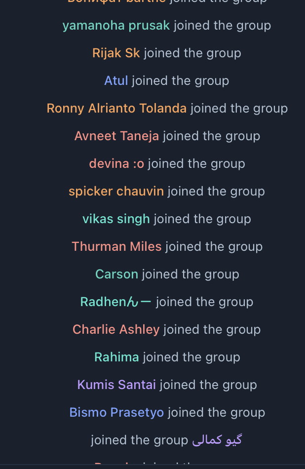

# telegram-banhammer [](https://github.com/paskal/telegram-banhammer/actions)

A program which uses MTProto Telegram API to ban spammers from a group.

Currently, the only filter is by the join time to kill the bot hoards.

<details><summary>Hoarders example</summary>


</details>

## CLI parameters

| Command line           | Default | Description                                                                                |
|------------------------|---------|--------------------------------------------------------------------------------------------|
| appid                  |         | AppID, _required_                                                                          |
| apphash                |         | AppHash, _required_                                                                        |
| phone                  |         | Telegram phone of the channel admin, _required_                                            |
| password               |         | password, if set for the admin, _optional_                                                 |
| channel_id             |         | channel or supergroup id, without -100 part, _required_                                    |
| ban-to-timestamp       |         | the end of the time from which newly joined users will be banned, _required for search_    |
| ban-search-duration    |         | amount of time before the ban-to-timestamp for which we need to ban users, _required for search_     |
| ban-search-offset      | `0`     | starting offset of search, useful if you banned the offenders in first N users already     |
| ban-search-limit       | `0`     | limit of users to check for ban, 0 is unlimited                                            |
| ban-and-kick-filepath  |         | set this option to path to text file with users clean up their messages, ban and kick them |
| search-ignore-messages | `false` | do not retrieve messages when searching for users to ban                                   |
| dbg                    | `false` | debug mode                                                                                 |
## Installation

On Mac, run `brew install paskal/telegram-banhammer/telegram-banhammer`. On other platforms, check the release page for binaries and installation packages for linux and download the one for your platform.

For local run, use `go run ./...` instead of the binary name.

For Docker, use `docker run -it --volume=$(pwd)/ban:/srv/ban paskal/telegram-banhammer:master /srv/telegram-banhammer` instead of the binary name.

## How to run

To get the channel ID, please see https://gist.github.com/mraaroncruz/e76d19f7d61d59419002db54030ebe35, and use it without the `-100` part in the beginning.

To get the AppID and AppHash, please see https://core.telegram.org/api/obtaining_api_id.

After gathering the results, they will be written to a file with the current timestamp in the `ban` directory: no bans will be issued. Feel free to check the results (and remove users you think shouldn't be banned) and rerun the program with `--ban-and-kick-filepath` flag.

### Gather list of users

`ban-to-timestamp` ([Unix time](https://en.wikipedia.org/wiki/Unix_time) format) and `ban-search-duration` (human-readable duration, like `60s` or `15m`) are mandatory.

```bash
telegram-banhammer --appid 123456 --apphash 123abcdf --phone +123456 --password "pass_if_present" --channel_id 1234567 --ban-to-timestamp 1666887600 --ban-search-duration 3m
```

### Clean messages, ban and kick users from the list

`ban-and-kick-filepath` must be set to the path to the file with the list of users to ban and kick.

```bash
telegram-banhammer --appid 123456 --apphash 123abcdf --phone +123456 --password "pass_if_present" --ban-and-kick-filepath ban/telegram-banhammer-2022-10-28T22-03-40.users.csv
```
